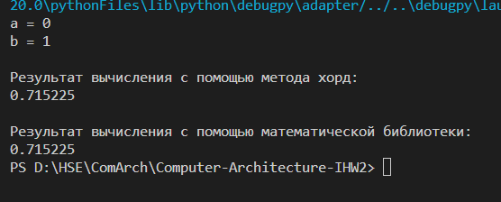
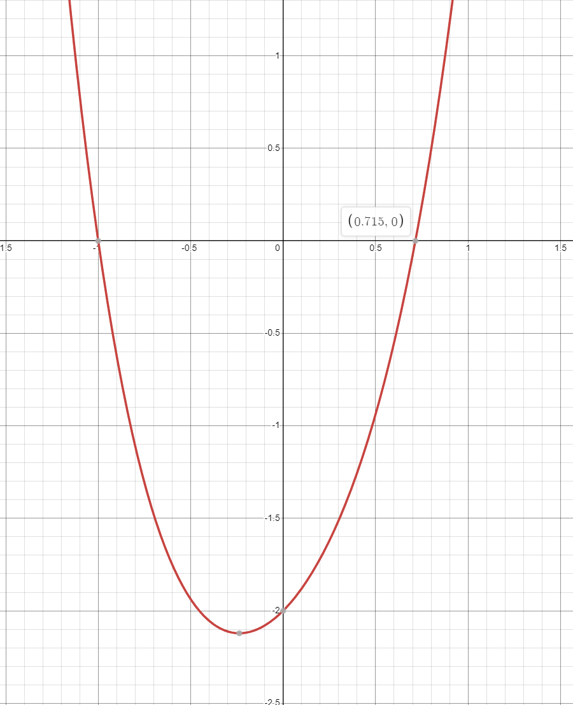
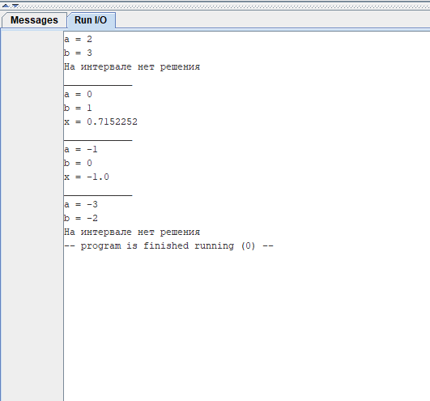
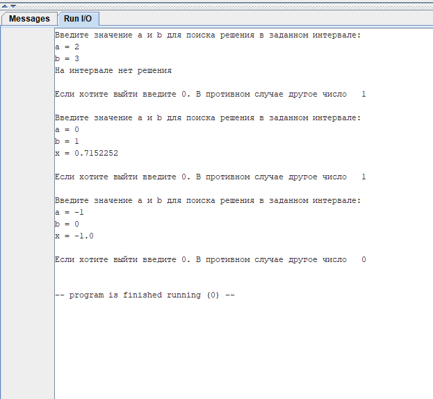
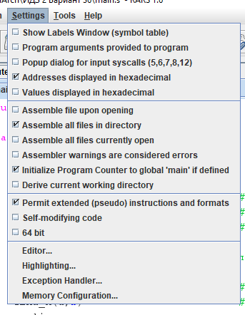

# Индивидуальное домашнее задание №1
## Евсюков Александр  <br/> Группа БПИ224  <br/> Вариант 36
## _Условие:_ 
Разработать программу, определяющую корень уравнения $ 2^{x^2+1} + x − 3 = 0 $ методом хорд с точностью от 0,001 до 0,00000001 в диапазоне [2;3]. Если диапазон некорректен, то подобрать корректный диапазон.

`Примечение:`
Так как было разрешено взять другое уравнение или модифицировать данное, мною было принято решение поменять местами степень и базу. В результате дальнейшие решение представлено для уравнения $ (x^2+1)^2 + x − 3 = 0 $

## _Информация о методе:_
Метод решения задачи приведен в статье: http://simenergy.ru/mathematical-analysis/basic-data/chord-method#:~:text=%D0%9C%D0%B5%D1%82%D0%BE%D0%B4%20%D1%85%D0%BE%D1%80%D0%B4%20

Согласно этой статье был написан следующий код на языке Python, а также была добавлена функция поиска решения с помощью математической библиотеки, чтобы понимать корректность полученного решения:

``` Python
import math
from scipy.optimize import fsolve

# Уравнение
def f(x):
    return (x**2 + 1)**2 + x - 3

def ChordMethod(a, b):
    if f(a)*f(b) <= 0:
        xn = b
        eps = abs(a - b)
        while eps > math.pow(10, -10):
            x0 = xn
            x = a - ((f(a)*(b - a)) / (f(b) - f(a)))
            if f(a)*f(x) < 0:
                a = a
                b = x
            if f(b)*f(x) < 0:
                a = x
                b = b
            xn = x
            eps = abs(xn - x0)
        print("\nРезультат вычисления с помощью метода хорд: ")
        print(round(xn, 6))
        return 0
    print("На интервале нет решения")
    return 0

# Поиск решения с помощью математической библиотеки   
def MathLib():
    result = fsolve(f, 0)
    print("\nРезультат вычисления с помощью математической библиотеки:")
    print(round(*result, 6))
    return 0

a=float(input("a = "))
b=float(input("b = "))
ChordMethod(a, b)
MathLib()
```
Результат работы программы:




Для визуализации уравнения и понимая интервалов, на которых лежат решения, был постоен график с помощью графического калькулятора Desmos. Благодаря этому стало понятно, что на интервале из условия [2;3] нет решений уравнения.



## _Тесты:_ 
На вход программа получает значения интервал [a;b]. В ответ выдает значение `x`, которая явлется решением уравнения на заданном интервале. Если на интервале нет решения, программа вывод соответствующее сообщение. 
| Ввод             	    | Вывод       	                |
|---------------------- |------------------------------ |
| a = 2<br> b = 3  	    | На интервале нет решения   	|
| a = 0<br> b = 1 	    | x = 0.7152252	                |
| a = -1<br> b = 0  	| x = -1.0     	                |
| a = -3<br> b = -2     | На интервале нет решения      |  

## _Результаты тестов:_


## _Текст программы:_
В качестве примера текста программы ниже приведен текст main, остальные подпрограммы и библиотека макросов лежат в репозитории. 
```
.include "macrolib.s"

.global main

main:
.data	
	.align  2               # Выравнивание на границу слова
	a: .float 0             # Левая граница интервала
	b: .float 0             # Правая граница интервала
.text
	print_str("Введите значение a и b для поиска решения в заданном интервале: ")
	newline
	read_a_and_b(a, b)      # Читаем a и b (передаем адреса на переменные)
	find_x(a,b)             # Поиск решения на заданном интервале (передаем адреса на переменные)
	newline
	repeat                  # Запрос на повторный запуск программы
	end	

```
Результат работы:



## _Дополнительная информация:_
* В файле `main` все вызовы подпрограмм обернуты в макросы
* Создана отдельная подпрограмма с уравнением, так как основная программа неоднократно обновляет значения f(x)
* Все переменные хранятся в памяти, чтобы не занимать регистры 
* Передача переменных происходит через регистры `a`, согласно общепринятому соглашению.
* Для удобства реализован повторный запуск программы по желанию пользователя
* При вызове подпрограммы происходит передача необходимых переменных. Данная функция реализована с целью создания программы, которая будет способна работать с разными данными, в том числе c пользовательскими переменными
* Дополнительная тестовая программа и файлы к ней расположены в папке `test_program`
* Для корректной работы программы необходимо включить следующие настройки: 
	<br/>